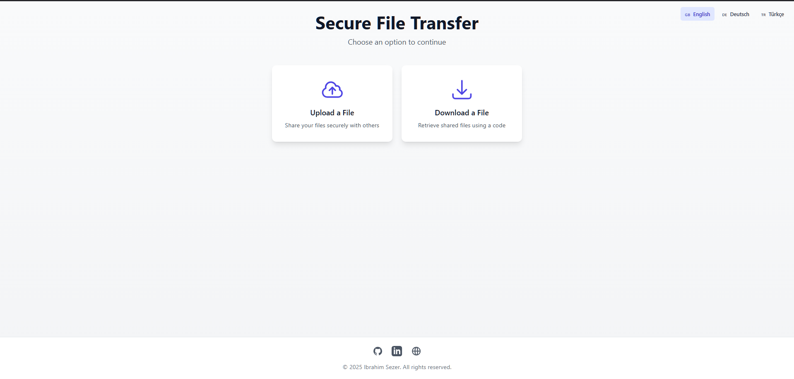
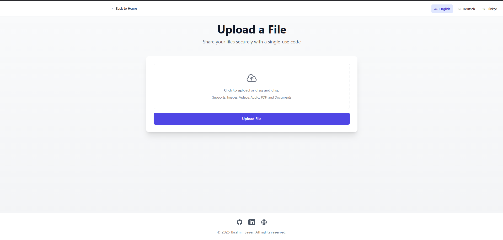
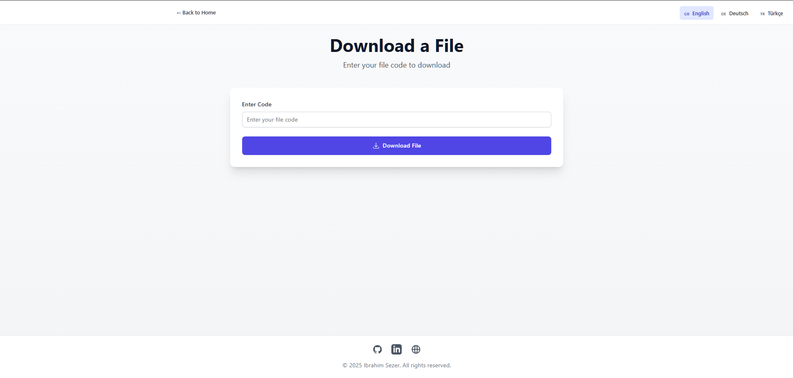

# File Transfer Web Interface

A  file transfer application that allows users to share files using single-use codes. Built with React, Node.js, and Express.


## 🌟 Live Demo

Try the application live at: [https://secure-file-tranfer.onrender.com](https://secure-file-tranfer.onrender.com)

> Note: The live demo is hosted on Render.com's free tier, so initial load might take a few seconds if the server has been inactive.

## 🌟 Features

- **File Sharing**: Transfer files using single-use download codes
- **Multi-language Support**: Available in English, German, and Turkish
- **Modern UI**: Clean and responsive interface built with Tailwind CSS
- **File Type Support**: Handles various file types including:
  - Images (JPG, PNG, GIF)
  - Documents (PDF, DOC, DOCX, TXT)
  - Audio (MP3, WAV)
  - Video (MP4, MOV, AVI)
- **File Size Limit**: Supports files up to 100MB
- **Auto-cleanup**: Files are automatically deleted after download

## 🚀 Getting Started

You can either use the live demo at [https://secure-file-tranfer.onrender.com](https://secure-file-tranfer.onrender.com) or run the application locally by following these steps:

### Prerequisites

- Node.js (v14 or higher)
- npm (v6 or higher)

### Installation

1. Clone the repository:
```bash
git clone https://github.com/ibrahimsezer/file_tranfer.git
cd file_tranfer
```
2. Install dependencies for both client and server:
```bash
# Install client dependencies
cd client
npm install

# Install server dependencies
cd ../server
npm install
```

3. Start the server:
```bash
# In the server directory
npm start
```

4. Start the client:
```bash
# In the client directory
npm run dev
```

The application will be available at `http://localhost:5000`

## 🔧 Usage

You can try the application directly at [https://secure-file-tranfer.onrender.com](https://secure-file-tranfer.onrender.com) or follow these steps for local usage: 

### Uploading a File

1. Click on "Upload a File" on the home page
2. Select a file by clicking the upload area or dragging and dropping
3. Click "Upload File"
4. Once uploaded, you'll receive a unique code
5. Share this code with the recipient

### Downloading a File

1. Click on "Download a File" on the home page
2. Enter the received code
3. Click "Download File"
4. The file will automatically download to your device
5. Note: Each code can only be used once

## 🛠️ Tech Stack

### Frontend
- React.js
- Vite
- Tailwind CSS
- i18next (Internationalization)
- Axios
- Heroicons

### Backend
- Node.js
- Express
- Multer (File handling)
- CORS
- nanoid (Code generation)

## 📁 Project Structure

```
file_tranfer/
├── client/
│   ├── src/
│   │   ├── components/
│   │   ├── translations/
│   │   ├── App.jsx
│   │   └── main.jsx
│   ├── public/
│   └── package.json
└── server/
    ├── index.js
    └── package.json
```

## 🌐 Internationalization

The application supports multiple languages:
- English (en)
- German (de)
- Turkish (tr)

Language can be changed using the language switcher in the top-right corner.

## 🔒 Security Features

- Single-use download codes
- Automatic file deletion after download
- File type validation
- Size limitations
- file storage

## 💻 API Endpoints

### POST `/upload`
- Uploads a file and returns a unique code
- Accepts multipart/form-data
- Returns: `{ code: string }`

### GET `/download/:code`
- Downloads a file using the provided code
- Returns: File stream with appropriate headers
- Deletes file after successful download

## 🤝 Contributing

1. Fork the repository
2. Create your feature branch (`git checkout -b feature/AmazingFeature`)
3. Commit your changes (`git commit -m 'Add some AmazingFeature'`)
4. Push to the branch (`git push origin feature/AmazingFeature`)
5. Open a Pull Request

## 📝 License

This project is licensed under the MIT License - see the [LICENSE](LICENSE) file for details.

## 👤 Author

Ibrahim Sezer
- GitHub: [@ibrahimsezer](https://github.com/ibrahimsezer)
- LinkedIn: [ibrahim-sezer](https://www.linkedin.com/in/ibrahim-sezer/)
- Website: [ibrahimsezer.github.io](https://ibrahimsezer.github.io)

## 🙏 Acknowledgments

- React.js community
- Tailwind CSS team
- All contributors and users of the project

## 📸 Screenshots





## 🌟 Star History

[](https://star-history.com/#ibrahimsezer/secure_file_tranfer&Date)

